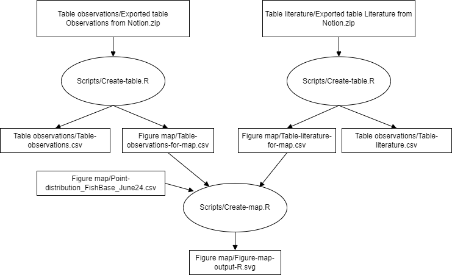

The following code has been used to create the figures and tables in the paper "Tool use by New World Halichoeres wrasses" by Tariel-Adam et al. 2025 published in Coral Reefs https://doi.org/10.1007/s00338-025-02633-w.

There are two R scripts "Create-table.R" and "Create-map.R".

# Create-table.R
All data are in Notion tables.  
The script 'Create-table.R' converts the exported tables from Notion into:
- a final table in csv format
- a table used for the map figure in csv format
- a table in Google Sheets

The script also calculates laterality index and some summary statistics. 

# Create-map.R
The script 'Create-map.R' create the map from the location of observations and from the point distribution of New World Halichoeres species. 

# Diagram

